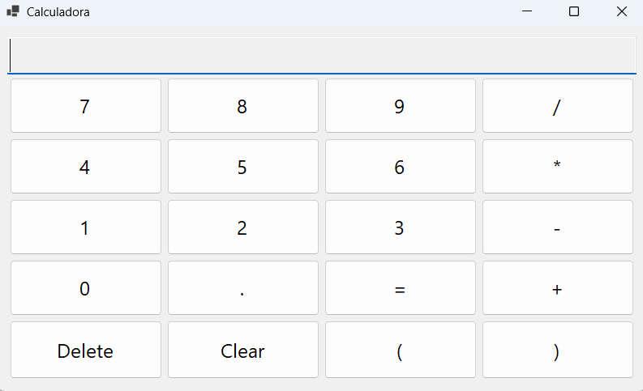

# ExpressionEvaluator

A mathematical expression evaluator built with .NET 10 and C#. It parses and evaluates infix expressions (e.g. `2*7/4-(8-9^(1/2))+6`) using the **shunting-yard algorithm** to convert them to postfix notation, then computes the result from the postfix representation.

## Supported Operators

| Operator | Description    | Precedence |
|----------|----------------|------------|
| `^`      | Exponentiation | Highest    |
| `*` `/`  | Multiplication, Division | Medium |
| `+` `-`  | Addition, Subtraction | Lowest |
| `(` `)`  | Grouping       | —          |

## Projects

| Project | Type | Description |
|---------|------|-------------|
| **ExpressionEvaluator.Core** | Class Library | Contains the `Evaluator` class with the parsing and evaluation logic. |
| **ExpressionEvaluator.UI.Console** | Console App | Demonstrates expression evaluation with sample expressions. |
| **ExpressionEvaluator.UI.Win** | Windows Forms App | GUI front-end (in progress). |

## Getting Started

```bash
# Build the solution
dotnet build

# Run the console application
dotnet run --project ExpressionEvaluator.UI.Console
```

## Usage

```csharp
using ExpressionEvaluator.Core;

double result = Evaluator.Evaluate("4*(5+6-(8/2^3)-7)-1");
```

## How It Works

1. **Infix to Postfix** — The input expression is converted from infix notation to postfix (Reverse Polish Notation) using the shunting-yard algorithm, which handles operator precedence and parentheses.
2. **Postfix Evaluation** — The postfix expression is evaluated using a stack-based approach: operands are pushed onto the stack, and each operator pops its operands, computes the result, and pushes it back.

---

# Cambios aplicados — Solución al error del diseñador y botones

Resumen de los cambios realizados para resolver el taller con el comportamiento de una calculadora y uso de sus funciones.

1) Problema identificado
- El diseñador de WinForms fallaba porque `InitializeComponent` contenía código dinámico (bucles y creación de controles) que el diseño no podía reconocer.
- Además el proyecto UI no referenciaba el proyecto `ExpressionEvaluator.Core` que causaba un errorr.

2) Cambio: mover creación dinámica de botones fuera del `.Designer.cs`
- Archivo modificado: `ExpressionEvaluator.UI.Win/Form1.Designer.cs`
  - Se eliminó la lógica de bucle y creación de botones dentro de `InitializeComponent`.

3) Cambio: creación de botones en tiempo de ejecución en la clase parcial
- Archivo modificado: `ExpressionEvaluator.UI.Win/Form1.cs`
  - Se agregó método privado `InitializeButtons()` que crea los botones y añadir  a `tableLayoutPanel1` en tiempo de ejecución.
  - Llamada a `InitializeButtons()` en el constructor justo después de `InitializeComponent()`.
  - Botones añadidos:
    - Fila 1: `7 8 9 /`
    - Fila 2: `4 5 6 *`
    - Fila 3: `1 2 3 -`
    - Fila 4: `0 . = +`
    - Fila 5: `Delete Clear ( )`
  - Implementación del botón `OnButtonClick`:
    - `Clear` borra todo (`txtDisplay.Text = string.Empty`).
    - `Delete` elimina solo el último carácter.
    - `=` evalúa la expresión usando `ExpressionEvaluator.Core.Evaluator.Evaluate`.
    - El resto de botones añaden su texto correspondiente al `txtDisplay`.

4) Se agrega referencia de proyecto al Core
- Archivo modificado: `ExpressionEvaluator.UI.Win/ExpressionEvaluator.UI.Win.csproj`
  - Se agrega `ProjectReference` a `..\\ExpressionEvaluator.Core\\ExpressionEvaluator.Core.csproj` para que el proyecto UI pueda usar `ExpressionEvaluator.Core`.

5) Diseño de UI para calculadora



## Autor

Liseth Andrea Mesa - desarrollado para el Taller #4 - Evaluador de funciones
